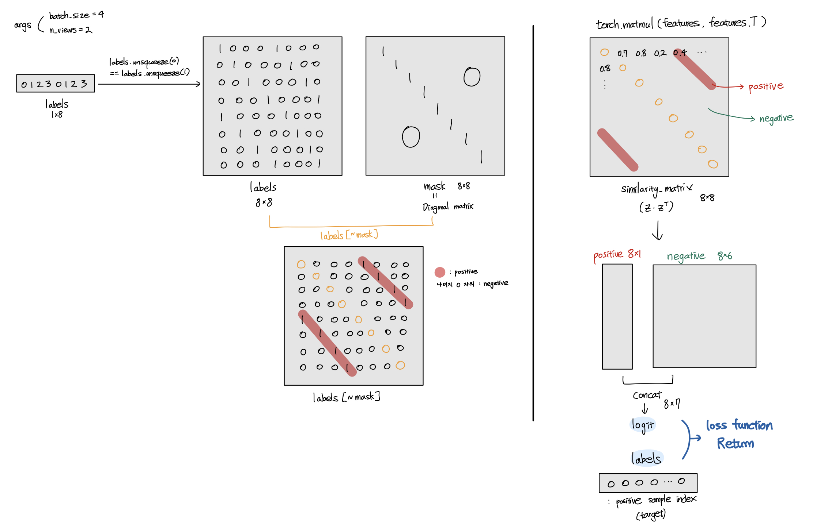

# **딥러닝 응용II:컴퓨터비전 최종 프로젝트**

## **SimCLR: A Simple Framework for Contrastive Learning of Visual Representations**

Paper link: [https://arxiv.org/abs/2002.05709](https://arxiv.org/abs/2002.05709)

Github link: https://github.com/parkjungha/SimCLR

---

## Code Exploration

**Repo Code Architecture**

```
└─ data_aug
│  └─ contrastive_learning_dataset.py # Load datasets and data augmentation
│  └─ gaussian_blur.py # Gaussian blur
│  └─ view_generator.py # Generate two cropped images
└─ exceptions
│  └─ exceptions.py # User-defined exceptions
└─ feature_eval
│  └─ mini_batch_logistic_regression_evaluator.ipynb # Colab code for evaluation
└─ models
│  └─ resnet_simclr.py # Load pre-trained model (ResNet) and add FC
└─ env.yml # Setting environment (conda)
└─ run.py # Run training
└─ simclr.py # SimCLR trainer
└─ utils.py # Save and evaluation utils
└─ requirements.txt
```

**Algorithm**

**1. Initialize components and arguments (Code:** [run.py](https://github.com/iamchosenlee/SimCLR-1/blob/1848fc934ad844ae630e6c452300433fe99acfd9/run.py#L75))

- Load dataset from path and define valid datasets. Pick one dataset either CIFAR-10 or STL-10.

```python
# load dataset while setting data path
dataset = ContrastiveLearningDataset(args.data)

# load valid dataset with defined transform
train_dataset = dataset.get_dataset(args.dataset_name, args.n_views)
```

- Put dataset in torch DataLoader.

```python
# put dataset in torch DataLoader
train_loader = torch.utils.data.DataLoader(
    train_dataset, batch_size=args.batch_size, shuffle=True,
    num_workers=args.workers, pin_memory=True, drop_last=True
)
```

- Load base encoder `f` (ResNet-50), `optimizer` (LARS), and `scheduler` (cosine decay schedule without restarts).

```python
# load base encoder f (ResNet)
model = ResNetSimCLR(base_model=args.arch, out_dim=args.out_dim)

### LARS optimizer
base_optimizer = optim.SGD(model.parameters(), lr=0.1)
optimizer = LARS(optimizer=base_optimizer, eps=1e-8, trust_coef=0.001)

scheduler = torch.optim.lr_scheduler.CosineAnnealingLR(optimizer,
							T_max=len(train_loader),
							eta_min=0,
							last_epoch=-1)
```

- Initialize SimCLR model and train it.

```python
# initialize SimCLR model
    simclr = SimCLR(model=model, optimizer=optimizer, scheduler=scheduler, args=args)
# train SimCLR model
    simclr.train(train_loader)
```

---

1. **Train SimCLR model (Code:**  [simclr.py — train()](https://github.com/iamchosenlee/SimCLR-1/blob/1848fc934ad844ae630e6c452300433fe99acfd9/simclr.py#L57) )
- Initialize

```python
class SimCLR(object):

    def __init__(self, *args, **kwargs):
        self.args = kwargs['args']
        self.model = kwargs['model'].to(self.args.device)
        self.optimizer = kwargs['optimizer']
        self.scheduler = kwargs['scheduler']
        self.writer = SummaryWriter()
        logging.basicConfig(filename=os.path.join(self.writer.log_dir, 'training.log'), level=logging.DEBUG)
        self.criterion = torch.nn.CrossEntropyLoss().to(self.args.device)

    def train(self, train_loader):
        scaler = GradScaler(enabled=self.args.fp16_precision)

# save config file
        save_config_file(self.writer.log_dir, self.args)

        n_iter = 0# global optimization step
        logging.info(f"Start SimCLR training for {self.args.epochs} epochs.")
        logging.info(f"Training with gpu: {self.args.disable_cuda}.")

# ... (train code described as below) ...
      n_iter += 1
```

- Iterate epoch and train_loader for each epoch

```python
for epoch_counter in range(self.args.epochs):
    for images, _ in tqdm(train_loader):
        images = torch.cat(images, dim=0)
        images = images.to(self.args.device)
```

- Produce image representation `features` (z) from `self.model`

```python
        with autocast(enabled=self.args.fp16_precision):
# backbone model + MLP outputs
            features = self.model(images)
```

- Calculate Info NCE loss from `features`

```python
# calculate Info NCE loss
            logits, labels = self.info_nce_loss(features)
            loss = self.criterion(logits, labels)
```

- Update network `f` and `g`, and minimize loss

```python
        self.optimizer.zero_grad()
        scaler.scale(loss).backward()
        scaler.step(self.optimizer)
        scaler.update()
```

- Calculate top-1 and top-5 accuracy, and log training loss and learning rateIterate epoch and train_loader for each epoch

```python
        if n_iter % self.args.log_every_n_steps == 0:
            top1, top5 = accuracy(logits, labels, topk=(1, 5))
            self.writer.add_scalar('loss', loss, global_step=n_iter)
            self.writer.add_scalar('acc/top1', top1[0], global_step=n_iter)
            self.writer.add_scalar('acc/top5', top5[0], global_step=n_iter)
            self.writer.add_scalar('learning_rate', self.scheduler.get_lr()[0], global_step=n_iter)
```

---

1. **Calculate InfoNCE loss** (**Code:** [simclr.py — info_nce_loss()](https://github.com/iamchosenlee/SimCLR-1/blob/1848fc934ad844ae630e6c452300433fe99acfd9/simclr.py#L26))

```python
def info_nce_loss(self, features):

        labels = torch.cat([torch.arange(self.args.batch_size) for i in range(self.args.n_views)], dim=0)
        labels = (labels.unsqueeze(0) == labels.unsqueeze(1)).float()
        labels = labels.to(self.args.device)

        features = F.normalize(features, dim=1)

        similarity_matrix = torch.matmul(features, features.T)

        # discard the main diagonal from both: labels and similarities matrix
        mask = torch.eye(labels.shape[0], dtype=torch.bool).to(self.args.device)
        labels = labels[~mask].view(labels.shape[0], -1)
        similarity_matrix = similarity_matrix[~mask].view(similarity_matrix.shape[0], -1)
        # assert similarity_matrix.shape == labels.shape

        # select and combine multiple positives
        positives = similarity_matrix[labels.bool()].view(labels.shape[0], -1)

        # select only the negatives the negatives
        negatives = similarity_matrix[~labels.bool()].view(similarity_matrix.shape[0], -1)

        logits = torch.cat([positives, negatives], dim=1)
        labels = torch.zeros(logits.shape[0], dtype=torch.long).to(self.args.device)

        logits = logits / self.args.temperature
        return logits, labels
```

**Explore above codes from the perspective of matrix operations,**



---

**Modification in Loss calculation**

```python
negatives = similarity_matrix[~labels.bool()].view(similarity_matrix.shape[0], -1)
# sorting the tensor in  descending order along the row
neg_sorted, indices = torch.sort(negatives, dim = 1, descending=True)
# select only top5 columns
neg_topk = neg_sorted[:, 0:5]
logits = torch.cat([positives, neg_topk], dim=1)

```

---

### **Installation**

```bash
$ conda env create --name simclr --file env.yml
$ conda activate simclr
$ python run.py -data ./datasets -dataset-name stl10 --log-every-n-steps 1 --epochs 10
```

---

### Experimental Results

|  | Original Code (All negative samples are used) | Top 5 negative samples Loss |
| --- | --- | --- |
| Loss | 1.9853 | 1.7917 |
| Top1 Accuracy | 60.7422 | 61.5993 |
| Learning Efficiency | ? | ? |
